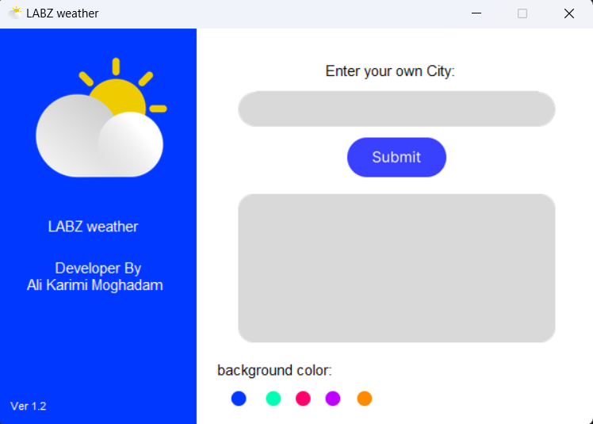

# LABZ-Weather

LABZ Weather it is so that you can understand the climate of any region you want.

## How to using?

For run you need to install requirements.txt file using `pip install -r requirements.txt` 

download this project.

Run `gui.py` 

## Roadmap

-Very easy user interface.

-being fast.

-completeness.

## updates

1- add error massage

2- change backgraond color 

## Screenshots

## License

[MIT](https://choosealicense.com/licenses/mit/)
